# Excel-Kickstarter-Project

## Problem Description: 
Though, over 2B is raised is Kickstarter crowdfunding platform, only a third of campaigns are successful in raising the required funds. 

## Analysis Goal: 
Find out the reasons behind success and failure in a Kickstarter campaign using the data from the past campaigns

### Exploratory Analysis

**Analysis identifies high and low performance categories based on their success rate. Some results are surprising !**

Kickstarter campaigns in music category has the highest success rate (About 77%) whereas journalism campaigns has striking 0% success rate (all of them are cancelled). Theatre and Film & Video are the other well doing categories with about 60% and 58% respectively. On the contrary, Food category is performing poor with a low 17% success rate. 

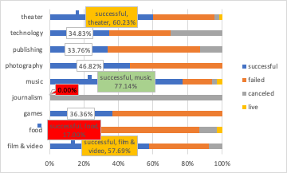

Looking into the sub-categories of the high and low performing categories indicate that
- Rock (a 100% success rate!) and indie rock contributes to the success of music category
- Theatre category is kind of a safe zone, where all the categories are likely to succeed more than half a time. Also, there are significantly more “plays”  than any other type of campaigns overall. However, this posses only about 65% success rate
- It seems like backers love non-fiction, radio & podcasts (both at 100% success rate) and totally hate everything else (100% failure rate)!
- Similarly, while table-top games getting  100% success mobile and video games getting 100% failure ! (Big surprise)
- “Wearable” campaigns are the main reason why Technology category is not performing. However, “hardware” campaigns are doing well with 100% success rate.
- Documentaries (in film & video category) has a 100% success rate! 
- “Food truck” campaigns (100% failure) are the main contributor to the low performance of “food” category 
The below graph helps to illustrate the success rate and the number of the campaigns for all subcategories. Moving towards up and right indicates high success with greater number of campaigns. “Rock” is giving 100% success rate with about 300 campaigns 

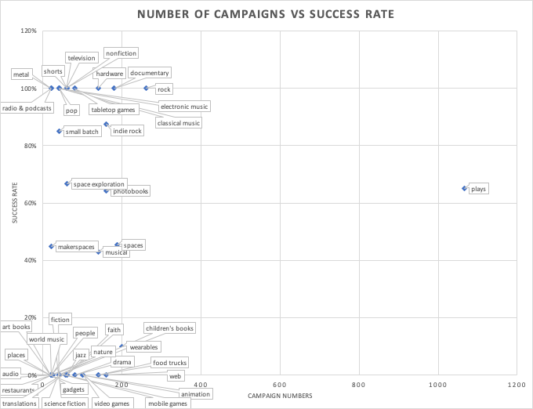

**
Kickstarter got extremely popular in 2015 as number of campaigns surged. However, this declined the success rate. This might be because, the number of backers and their investment might not have increased proportionately, resulting in the investment splitting across multiple projects, leading to many projects not able to meet the goal.
**

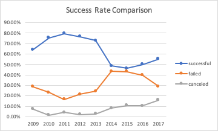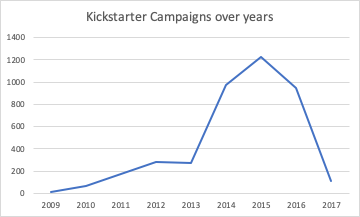

The total campaign numbers finds a peak at 2015, however, it appears that success rate is relatively low in that year. Though, there is a growth of Kickstarter campaigns  between 2013 to 2015, success rate declined during this period with a higher failure rate. And it is growing upwards since then, though the total number of campaigns are reducing. 

**Least campaigns happens in December but also, this month sees the lowest success rate. This might not be a surprise as it is a festival month and people usually takes off from work**

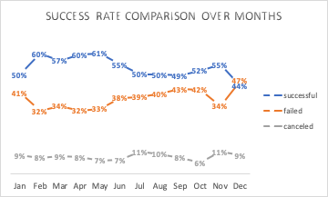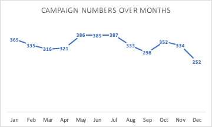

**Based on further Analysis**

**There are fewer campaigns with higher goals. Also, as the goal amount increases success rate decreases, with an exception between 30000-50000 with a slight increase**

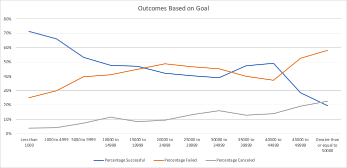

### What are some limitations of this dataset?

- The analysis has only limited data. 
  - The critical information about campaign owners and members (for example the stars acting in a TV show), the success (failure) history of campaign owners based on their previous campaigns (if any) are not present
  - Information on traffic to the campaign is not given (click stream analytics/google analytics) to understand the important information like the conversion rate (How likely a backer pledge after viewing the campaign? This could be proxying how interesting the campaign is)
  - This analysis is solely based on parameters given below:

   - goal – required funding
   - pledged – obtained funding
   - state – state of the campaign (successful, failed, live, canceled)
   - country
   - currency
   - deadline
   - launched_at
   - staff_pick – kickstarter chosen interesting campaigns
   - backers_count – No of backers
   - spotlight – Feature gets kicked in after successful funding (not useful)
   - Category and Sub-Category

 - Not having a detailed description (apart from “name” and “blurb”) of the campaigns to do an effective analysis (E.g.: Predict whether a campaign succeeds or not based on the text in description. This proxies how well the description is crafted. A bad written campaign cover might end up failing, just like a badly done resume gets no attention)

 - Dataset doesn’t contain information on a daily basis pledge details, rather contains only the final/total outcome (This information could have been used for understanding the relationship with time and pledge amount for different campaigns. For instance, if we identify a successful campaign’s pledge grows exponentially over time (per days), it is possible to predict the status of the campaigns well in advance and can take proactive measures to ensure the success.

### What are some other possible tables and/or graphs that we could create?

Along with the plots used to explain above conclusions, the below ones could be useful

- A frequency plot (histogram), to capture the relationship between state and backers (1 each for success and failed states). This is to see if there is any relationship between number of backers and the destiny of the campaign

- A frequency plot (histogram), to capture the relationship between state and goal (1 each for success and failed states). This is to see if there is any relationship between the goal and the destiny of the campaign

- A frequency plot (histogram), to capture the relationship between duration and goal (1 each for success and failed states). This is to see if there is any relationship between the duration and the destiny of the campaign

- A pivot table between state and staff_pick showing the count of campaigns. This is to understand if there is any advantage of being chosen as a staff_pick campaign

The statistical measures on backers count for successful and failed campaigns are as shown below

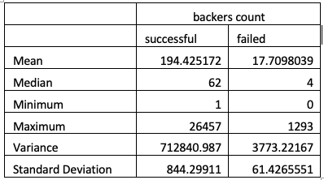

Median summarizes the data better. Here mean appears to be skewed towards the max as large number of backers in a few campaigns skews the average towards them. Whereas median being the middle value gives a better understanding that half a times the number of backers is less than median, and a half a times greater than that. Also, note that Standard Deviation is very high. This also indicates that using Mean is not a good idea to summarize the data

## Statistical Analysis and Final Conclusions

**A frequency plot  to capture the relationship between state and backers (1 each for success and failed states) is shown as below. 

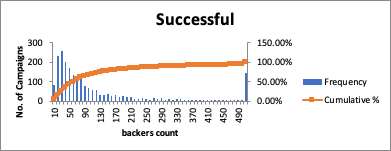

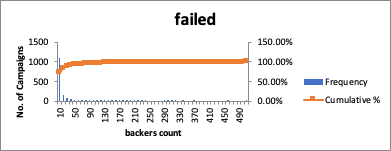

**It shows that lesser number of campaigns have higher number of backers.
However, majority of successful campaigns tend to have more backers**

Statistical Analysis:

Let  and   be the mean of backers count for the successful and failed campaigns respectively. The below are the sample statistics that has been obtained for the backers count. As per central limit theorem(CLT), sample mean is normally distributed with mean and std. deviation equals to  and  where  and  are the mean and the standard deviation of the population. As the samples are large (> 30), we can also approximate /√n as s/√n where is s is the standard deviation of samples. 

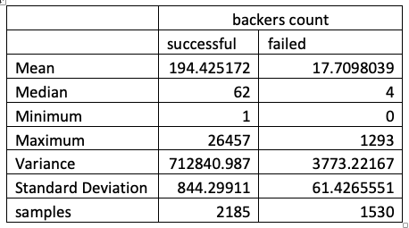

We can perform z-test to validate the below hypothesis statistically. Significance level,  = 0.01 is being used in all the tests

Hypothesis:

 Null hypothesis, Ho  :    150 

  Alternate hypothesis H1  :   > 150 

Z Statistic is   where  is the sample mean, S is the standard deviation of the sample (standard error) and n is the number of samples. Z Statistic = 2.4595 and  P value is  
0.0069. This P value is the probability of observing the sample mean as it is, given the population  mean (mean backers_count) is 150. As the p-value is less than the significance level  = 0.01, null hypothesis is rejected. **
Implies that, average backers_count  for a successful campaign is > 150
**

Hypothesis:

 Null hypothesis, Ho  :    50 

 Alternate hypothesis H1  :    < 50 

Z Statistic = -20.56 and  P value is  0.00. As the p-value is less than the significance level  = 0.01, null hypothesis is rejected. **
Implies that, average backers_count  for a failed campaign is < 50
**
  
  
**A frequency plot  to capture the relationship between state and goal is shown as below**

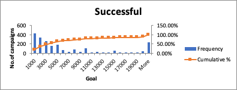

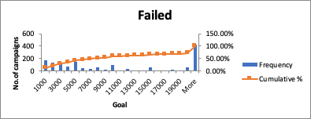

**It shows that majority of the successful campaigns tend to have smaller goal than failed campaigns**

The below are the sample statistics that has been obtained for the goal amount.

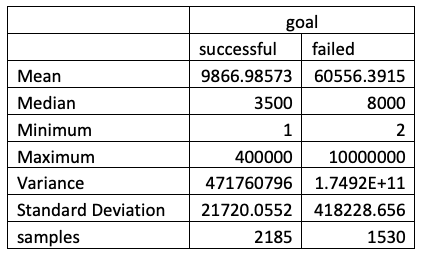

Let  and   be the the mean of the goal amount for the successful and failed campaigns respectively. Here also, for the same reasons explained in section <a href="#z-test">above</a>, z-test can be performed
  

Hypothesis:

 Null hypothesis, Ho  :    150,000 

  Alternate hypothesis H1  :   < 150,000 

Z Statistic = -11.05 and  P value is  0.00. As the p-value is less than the significance level   = 0.01, null hypothesis is rejected. **
Implies that, average goal amount  for a successful campaign is < 15,000
**

Hypothesis:

 Null hypothesis, Ho  :    30,000 

 Alternate hypothesis H1  :    > 30,000 

Z Statistic = 2.86 and  P value is  0.0021. As the p-value is less than the significance level   = 0.01, null hypothesis is rejected. **
Implies that, average goal amount  for a failed campaign is > 30,000 
**

**A frequency plot to capture the relationship between  state and duration is shown as below**

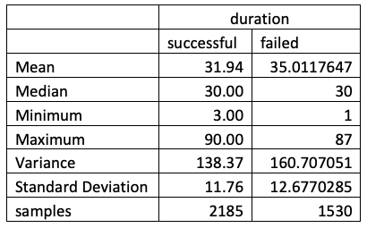

Let  and   be the mean of the duration for the successful and failed campaigns respectively. Here also, for the same reasons explained in section <a href="#z-test">above</a>, z-test can be performed.

Hypothesis:

 Null hypothesis, Ho  :    33 

  Alternate hypothesis H1  :   < 33 

Z Statistic = -4.21 and  P value is  0.00. As the p-value is less than the significance level   = 0.01, null hypothesis is rejected. **
Implies that, average duration  for a successful campaign is < 33 days
**
  

Hypothesis:

 Null hypothesis, Ho  :    34 

 Alternate hypothesis H1  :    > 34 

Z Statistic = 3.12 and  P value is  0.0009. As the p-value is less than the significance level   = 0.01, null hypothesis is rejected. **
Implies that, average duration  for a failed campaign is > 34 days
**

**A pivot table between state and staff_pick showing the count of campaigns. This is to understand if there is any advantage of being chosen as a staff_pick campaign**

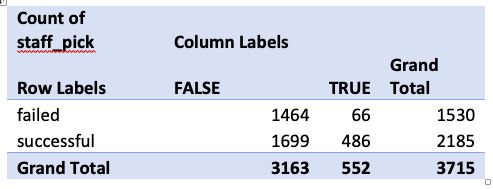

**Though only, a small percentage of the campaigns were staff picked (552 out of 3715 = 15%), once picked, campaigns show a success rate of 88%. Means, all the work needs to get packed by Kickstarter staffs seems to worth a lot.**

Statistical Analysis:

Chi-square test of independence is performed to validate the below hypothesis

Hypothesis:

H0  :  Campaign states and  staff_pick feature are independent

H1  :  Campaign states and  staff_pick feature are NOT independent

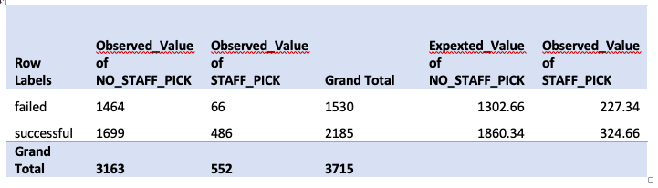

 statistic = 228.64
df = 1
 critical value = 6.63

 statistic >  critical value

Alternatively, p value is 0 which is less than 0.01. Hence the Null hypothesis is rejected. 
**
Implies, Campaign states and  staff_pick feature are NOT independent
**
